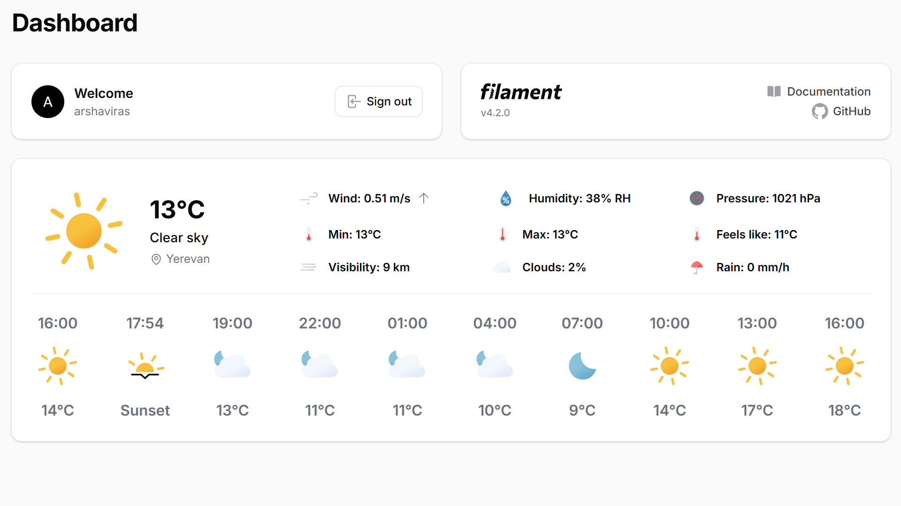
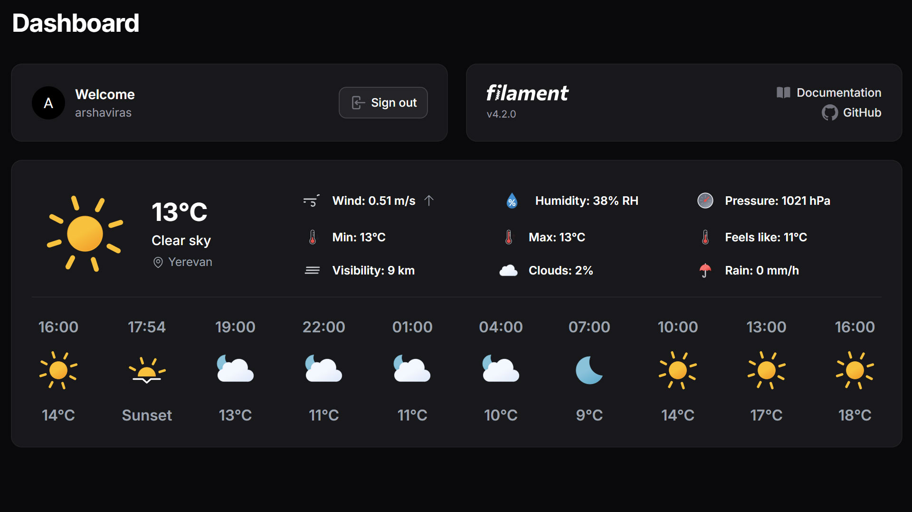
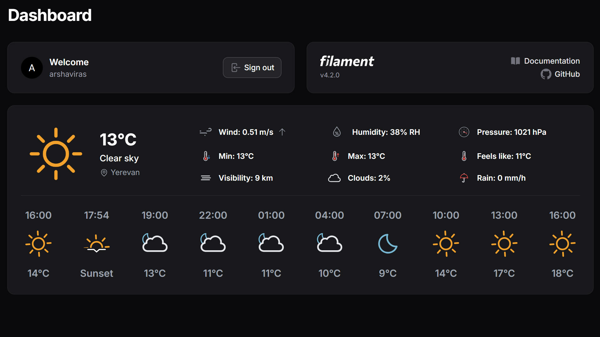
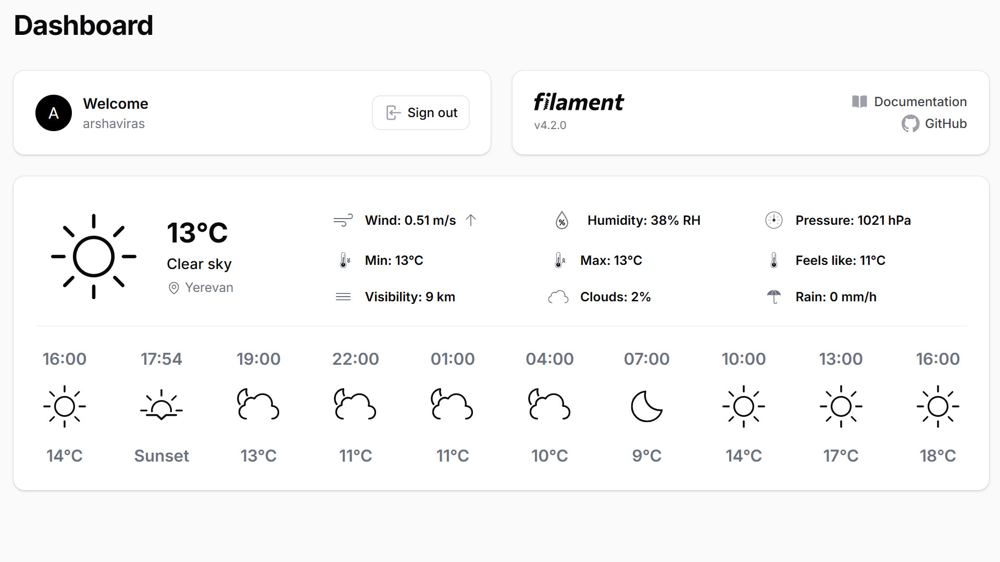
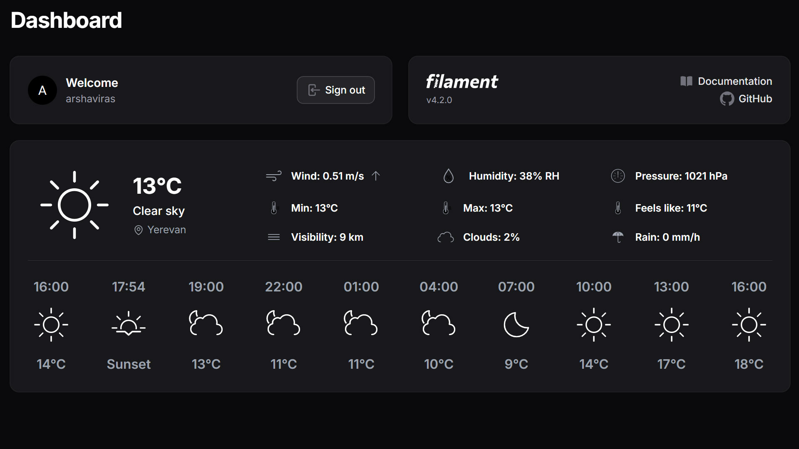

# Weather Widget


A beautiful, configurable **weather widget** for your Filament dashboard.  
Powered by the OpenWeatherMap API, fully translatable, and supports °C/°F, animated Weather Icons, and optional response caching.

## Features

- 🌤️ Displays current temperature, condition, hourly forecast and weather icons
- 🔁 Auto-refresh at a configurable interval
- ☁️ Supports both **metric** and **imperial** units (°C/°F)
- 🌍 Multi-language support
- 🧠 Optional caching (prevents exceeding API rate limits)
- ⚙️ Customizable location by `city`
- 🎨 Supports 3 icon styles: **Monochrome**, **Line**, and **Fill**
- 🔄 Supports **static and animated** icon variants

## Requirements

- PHP 8.2 or higher
- Laravel 11.x or 12.x
- Filament 4.x

## Installation

You can install the package via composer:

```bash
composer require arshaviras/weather-widget
```

## Setup

### 1. Register the Widget

Add the widget to your Filament panel configuration:

```php
use Arshaviras\WeatherWidget\Widgets\WeatherWidget;
use Filament\Panel;

public function panel(Panel $panel): Panel
{
    return $panel
        // ... other configuration
        ->widgets([
                //...
                WeatherWidget::class,
            ])
}
```

### 2. Configuration

Publish the config file:

```bash
php artisan vendor:publish --tag="weather-widget-config"
```

This is the contents of the published config file:

```php
return [

    /**
     * API Key for Current Weather Data
     * You can get your API key from OpenWeatherMap:
     * https://openweathermap.org/price
     */
    'api_key' => env('OPENWEATHER_API_KEY', ''),


    /**
     * Default city for weather data
     */
    'city' => 'Yerevan',


    /**
     * Units for temperature and other measurements
     * Options: 'metric', 'imperial'
     * 'metric' - Celsius (°C), 'imperial' - Fahrenheit (°F)
     * Default is 'metric'
     */
    'units' => 'metric',

    
    /**
     * Refresh (Poll) interval in minutes
     * This determines how often the weather data will be refreshed.
     * This also factors into the cache duration.
     */
    'refresh_minutes' => 30, 

    /**
     * Icon settings
     * You can customize the icon set and variant used in the widget.
     * 'icon_set' can be 'fill', 'line', or 'monochrome'.
     */
    'icon_set' => 'fill',

    /**
     * Icon variant
     * Options: 'static', 'animated' (only for fill/line icons)
     */
    'icon_variant' => 'animated',
];
```

### 3. Translations (Optional)

If you want to customize the translations, you can publish the translations file:

```bash
php artisan vendor:publish --tag="weather-widget-translations"
```

## Usage

Once the widget is registered, a "Weather Widget" will automatically be added to your Filament Dashboard.

### Available Icon Sets

- `fill` – Filled icons
- `line` – Outlined icons
- `monochrome` – Black/White icons

#### 🎨 `fill` – Filled Icons
| Light Mode                                | Dark Mode                               |
|-------------------------------------------|-----------------------------------------|
|  |  |

#### ✏️ `line` – Outlined Icons
| Light Mode                                | Dark Mode                                |
|-------------------------------------------|------------------------------------------|
|  |   |

#### 🌓 `monochrome` – Black & White Icons
| Light Mode                                       | Dark Mode                                        |
|--------------------------------------------------|--------------------------------------------------|
|  |  |

### Available Icon Variants
Static and Animated (only for fill/line icons)

- `static` - Static Icons
- `animated` - Animated icons

## Credits

Meteo Icons by [Bas Milius](https://bas.dev)